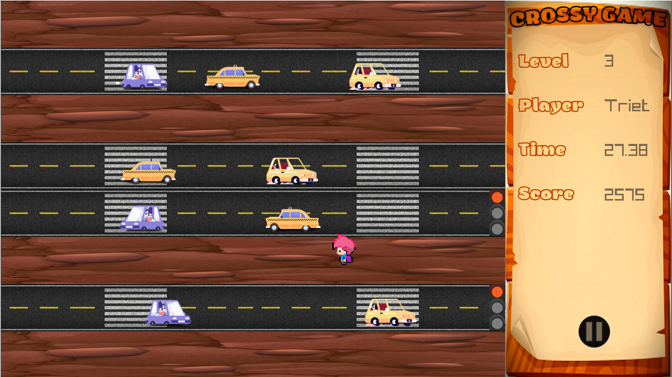

<!--Project logo and contributors-->
 

  
  
HCMUS

  
CS202 - Programming Systems

  

    <a href="https://github.com/NDTungHCMUS">Nguyen Dinh Tung</a>
     
    <a href="https://github.com/NgHuuTrong">Nguyen Huu Trong</a>
     
    <a href="https://github.com/vuongquocphong">Vuong Quoc Phong</a>
     
    <a href="https://github.com/triet0612">Dang Minh Triet</a>
     
  

<!--Table of contents-->

## About the project
Crossing Road is a game application using OOP concepts and Design Pattern (Singleton Pattern). The goal of this game is to control the player to overcome obstacles (including various types of vehicles) to reach the finish line. If the player collides with an object on the road, they will immediately lose. Try to earn as many points as possible to get your name on the leaderboard.

## Screens
### Login

    
    

- Player can choose an existing account or create new account before playing game.

### Main Menu

    

- Player can continue the previous process (for existing account) or create new game (start from level 1).
- Player can navigate to leaderboard, instruction or sign out of this account.

### Game Play

    
    

    
    

- Player need to pass through the road without any collisions to complete each level. 
- The number of levels is unlimited.
- If you win, you can either go to next level or go home. If you lose, let's play again and conquer all the missions.

### Leaderboard and instruction

    
    

- The score of each player is based on his/her level and the playing time.
- Player should read the instruction first before going to the challenge.
